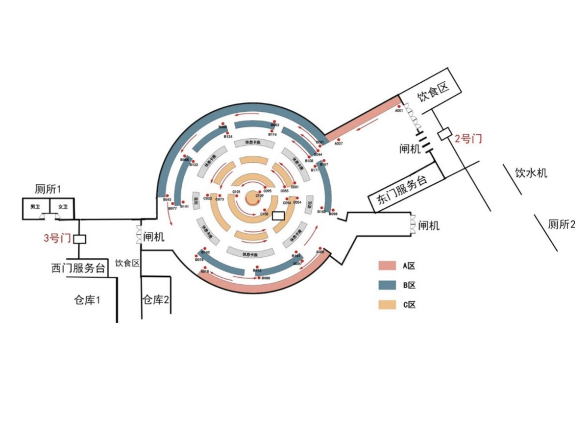

# 常见问题
## 区域分布（包括饮食、仓库、水房等）

## 预约或者签到问题
无法预约/签到失败等：至东门或西门服务台进行申报
脸部识别/个人信息等：至信息办查看学籍信息是否录入正确，新办的卡是否录入信息（常见于新生或者插班生）

## 空调问题
自行常备衣服
告知东门保安，如核实为共性问题会予以调整

## 身体不适
东门助管台配有感冒/生理期等基础药品

## 定期清理收拾物品的位置
暂存至仓库2（请勿将仓库作为存放点，此处不定期清理，遗失自负）

## 失物招领
东门助管台失物招领处
金额巨大请告知保安，并前往北门武保处调看监控

## 退座
到预约结束时间：系统自动退座，座位释放供他人预约
未到预约结束时间：需提前离开应进入预约卡片点击“退座”按钮，或扫描座位对应二维码点击“退座”按钮，座位释放供他人预约

## 约定好的时间座位上有人或物品
提醒当前同学离开，或将占座物品挪走；如遇特殊情况，可至东门助管台找保安帮助